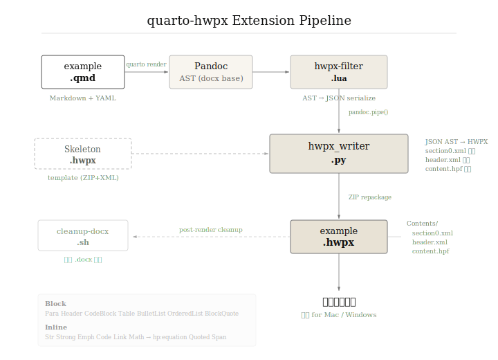

# quarto-hwpx

Quarto 마크다운(`.qmd`)을 한글과컴퓨터 HWPX 문서(`.hwpx`)로 변환하는 Quarto 확장(Extension).



## 설치

```bash
quarto add bit2r/quarto-hwpx
```

## 사용법

```yaml
---
title: "보고서 제목"
subtitle: "부제목"
author: "작성자"
date: today
format:
  hwpx-docx:
    toc: true
---
```

```bash
quarto render example.qmd --to hwpx-docx
# → example.hwpx 생성 (.docx 중간 파일은 자동 삭제)
```

## 동작 원리

1. Quarto가 `docx` 베이스 포맷으로 Pandoc 호출
2. `hwpx-filter.lua`가 Pandoc AST를 JSON으로 직렬화
3. `pandoc.pipe()` 로 `hwpx_writer.py` 호출
4. Python이 `Skeleton.hwpx` 템플릿을 열어 XML 재생성
5. 새 ZIP으로 `.hwpx` 저장
6. `cleanup-docx.sh`가 중간 `.docx` 삭제

## 지원 요소

### Block 요소

| Pandoc Block | HWPX 처리 |
|---|---|
| `Para`, `Plain` | `<hp:p>` 본문 (10pt, 160% 줄간격) |
| `Header(1~6)` | 개요 스타일 (H1=22pt bold, H2=16pt bold, H3=13pt) |
| `CodeBlock` | D2Coding 고정폭 폰트, 줄별 분리 |
| `BulletList` | "• " 글머리 기호 |
| `OrderedList` | "1. " 자동 번호 |
| `BlockQuote` | 전각 공백 들여쓰기 |
| `Table` | 가운데정렬, 실선 테두리, 캡션 지원 |
| `HorizontalRule` | "━━━" 구분선 |
| `DefinitionList` | 용어 + 들여쓰기 정의 |

### Inline 요소

`Str`, `Space`, `SoftBreak`, `LineBreak`, `Strong`, `Emph`, `Code`, `Link`, `Quoted`, `Span`

### 수식 (Math)

LaTeX 수식을 한글 수식 스크립트로 자동 변환하여 `<hp:equation>` 객체로 렌더링:

```markdown
$NPV = \sum_{t=0}^{n} \frac{B_t - C_t}{(1 + r)^t}$
```

→ `NPV = sum from{t=0} to{n} {B_t - C_t} over {(1 + r)^t}`

### 메타데이터 (Title Block)

YAML 헤더의 `title`, `subtitle`, `author`, `date`를 문서 본문 상단에 렌더링.

## 폰트 매핑

| 언어 | 폰트 | 용도 |
|---|---|---|
| HANGUL | NanumSquareOTF | 한글 본문/제목 |
| LATIN | NimbusSanL | 영문 산세리프 |
| HANJA | Noto Sans CJK KR | 한자 |
| SYMBOL | STIX Two Text | 수식/기호 |
| 코드 | D2Coding | CodeBlock 전용 |

## 기술 노트

- **한글 Mac 호환**: raw XML 문자열 방식으로 namespace prefix (`hp:`, `hs:`, `hc:`, `hh:`) 유지
- **linesegarray**: 텍스트 길이 기반 다중 lineseg 항목 계산 (한글 Mac 레이아웃 캐시 필수)
- **외부 의존성 없음**: Python 표준 라이브러리만 사용

## 프로젝트 구조

```
quarto-hwpx/
├── _extensions/hwpx/
│   ├── _extension.yml          # Quarto 확장 설정
│   ├── hwpx-filter.lua         # Lua 필터: AST → JSON → Python
│   ├── hwpx_writer.py          # Python: JSON AST → HWPX
│   ├── Skeleton.hwpx           # HWPX 템플릿 (ZIP+XML)
│   ├── cleanup-docx.sh         # 중간 .docx 삭제
│   └── assets/
│       ├── extension-diagram.svg   # 파이프라인 다이어그램
│       ├── brother_template.hwpx   # 참조 템플릿
│       └── fonts/                  # 번들 폰트
├── _quarto.yml                 # 프로젝트 설정
├── example.qmd                 # 테스트 문서 (공공기관 보고서)
├── CLAUDE.md                   # AI 코딩 에이전트 지침
└── README.md                   # 이 파일
```

## 라이선스

- Skeleton.hwpx: [airmang/python-hwpx](https://github.com/airmang/python-hwpx) (MIT)
- 폰트: [bit2r/bitPublish](https://github.com/bit2r/bitPublish/), [Noto CJK](https://github.com/notofonts/noto-cjk)
